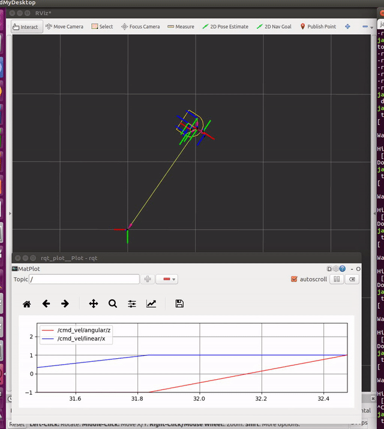
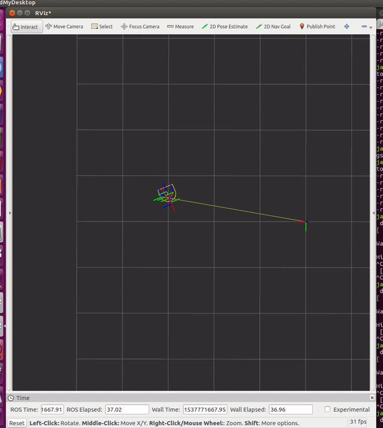
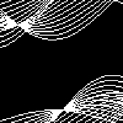
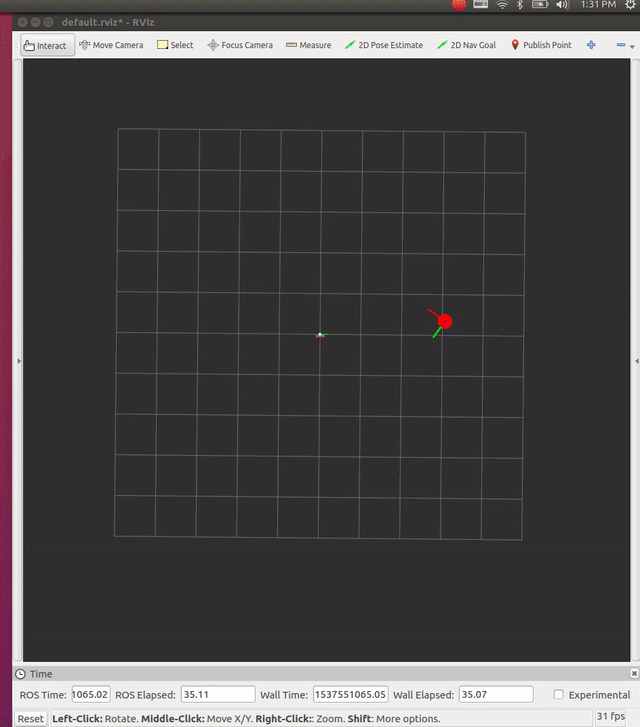

# Comprobo Warmup Project

*ENGR3590: A Computational Introduction to Robotics, Olin College of Engineering, FA2018*

*Yoonyoung Cho*

This project is an introductory *warmup* project for CompRobo at Olin College.

As a means of gaining familiarity with robotics software algorithms in basic perception and reactive control, I implemented six fundamental robot behaviors on the Neato mobile robot:

* [Teleoperation](#Teleoperation)
* [Driving a Square](#Square-Driver)
* [Wall Follower](#Wall-Follower)
* [Obstacle Avoidance](#Obstacle-Avoidance)
* [Person Follower](#Person-Follower)
* [Finite-State Controler](#Finite-State-Controller)

## Teleoperation

[[source]](scripts/teleop.py)

Teleoperation (*"teleop"*) of a mobile robot is a manual remote control of a mobile robot through network connectivity.

Specifically, my implementation of teleop exposed a keyboard interface as a means to command velocity to the robot through the ROS network.

Following the standard implementation from the [teleop_twist_keyboard](http://wiki.ros.org/teleop_twist_keyboard) ROS package, the key bindings were as follows:

| key | lin.vel.x | ang.vel.z | repr    |
|:---:|:---------:|:---------:|:-------:|
|  i  |    1      |    0      | &uarr;  |
|  j  |    0      |    1      | &larr;  |
|  k  |    0      |    0      | &#9940; |
|  l  |    0      |   -1      | &rarr;  |
|  ,  |   -1      |    0      | &darr;  |
|  u  |    1      |    1      | &#8598; |
|  o  |    1      |   -1      | &#8599; |
|  m  |   -1      |   -1      | &#8601; |
|  .  |   -1      |    1      | &#8600; |

In order to best provide flexibility for each of the behaviors, the default scaling factor for each of the components were exposed as ROS parameters `~v_scale` and `~w_scale`. For safety of operation, a `~timeout` parameter was also used, so that if the timestamp of the last commanded velocity is greater than `timeout` seconds in the past, the teleoperation node will issue the linear and angular velocity of zero, stopping the mobile base. Upon termination by `Ctrl-C (SIGINT)`, the program will gracefully handle the signal and also publish the velocity of zero, to prevent the mobile base from wandering away without the operator being able to control the robot.

The user could also optionally provide a `~period` parameter to define the period at which the command will be repeated; if the value of the period is greater than one, the repeat flag is set - otherwise, the `cmd_vel` topic will only be published everytime the key is pressed.

One challenging aspect of implementing teleop was to implement a non-blocking protocol for getting keypress information from the OS. Because checking for readiness by `select.select([sys.stdin], ...)[0]` did not work reliably (i.e. it ignored inputs), I had to run a separate thread dedicated to reading from the input stream, and run it in a loop in parallel to other logic in the teloperation handling node.

If I had more time, I would probably have added more UI logic, such as increasing and decreasing speed scaling factors, which are provided in the stadard package; it would also have been useful to add additional capabilities such as state-assignment logic (for standard FSM controllers). This is also somewhat of a takeaway on my part -- previously, when I tried to implement user input, I relied on button mappings to joysticks. If I could customize the keyboard teleop like I did for this assignment, controlling the robot during testing/prototyping phase would be much easier since I wouldn't have to rely on multiple layers of wrappers around often unreliable joystick connectivity -- on top of needing an extra input device and USB port availability.

## Square Driver

[[source]](scripts/drive_square.py)

    
The behavior of a robot driving through a square is an abstraction of a generalized static-trajectory following scenario, where the robot essentially follows a series of waypoints while minimizing driving time and the the amount of deviation. For this particular problem, two options were provided in implementation: open-loop or closed-loop control. In order to maximize the robustness of the solution, I chose to implement a closed-loop controller with feedback from the wheel encoders as an estimate of the current position. Although the wheel encoder accumulates error over time, it was a good enough approximation for the relatively simple trajectory that the robot was following.

The node was configured so that it could take two different types of input as odometry source: the transformation through `tf`, or `/odom` topic of type `nav_msgs/Odometry`. Two control parameters `~gtol` and `~atol` were exposed as goal position tolerance in euclidean distance, and yaw angle tolerance during waypoint following.

Because the code itself was relatively straightforward, it did not pose a significant challenge throughout the implementation. If I were to make the square driver more robust, I would have incorporated a PID controller and tuned the parameters, since (from the figures) it is apparent that discontinuous yaw error correction distorts the shape of the square a little.

## Wall Follower

[[source]](scripts/wall_follower.py)

Wall following behavior for a mobile robot is an example of a  reactive behavior that can be quite useful in practice, such as indoor environments with narrow corridors. While the *"wall"* to be followed may be defined in multiple different ways, I chose the closest right-facing point as the representative point for the wall. Under the assumption of a wall with relatively simple geometry, a PID controller with a fixed distance setpoint will naturally align with the wall over time in order to maintain the distance with the wall.

My implementation consists of a two-phase wall follower, where the behavior is depenent on whether or not there exists an obstacle in front of the robot. Should there be an obstacle, the robot will kill its forward velocity and turn at a fixed rate until the front view is cleared. Otherwise, the robot searches for the right wall. If there is no wall (either no points were detected on the lidar or all points at the right side of the robot are at a greater distance than the threshold for the available wall to follow), then the robot will trace a relatively large circle with a radius of about 6.7m in order to search for the wall.

The PID controller only acts on the angular velocity of the robot, so the robot is steered at a constant linear velocity of `0.2m/s` during the wall-following phase; specifically, the control parameters have been tuned to the following set of constants:

| constant | value |
|:--------:|:-----:|
| kp       | 0.5   |
| ki       | 0.05  |
| kd       | 0.0   |
| max_u    | 0.4   |
| max_i    | 0.1   |

(Note that `max_u` and `max_i` parameters stand for maximum control output and maximum integral windup, respectively)

The biggest challenge I faced for the wall follower was probably choosing the right feature to track for the PID controller. Initially, I tracked the whole right-half and the whole front-half of the lidar scan data for forward-obstacle and right-wall detection, but ultimately had to narrow down the range in order to prevent erratic behavior caused by points that should not be considered as obstacles for a forward-moving vehicle.

The wall follower probably has a number of improvements on the queue, should I have more time to work on it. For instance, I initially implemented a hough-transform based wall detector, with the assumption that the wall will largely be composed of linear features:

The above figure is the hough transform run on two randomly generated lines; as seen, there are two regions of high density that could be classified as a wall.

However, in the interest of time, I implemented a lightweight nearest-point based wall follower, instead of a full robust alignment with walls. I'll probably end up finishing the [wall detector](src/warmup_project/wall_detector.py) at some point in the future, mostly for curiosity.

## Obstacle Avoidance

[[source]](scripts/obstacle_avoider.py)

Obstacle avoidance lies at the heart of reactive control, for what might be called the *hindbrain* in biological analogues. This capability allows for interoperation with higher-level pathplanning and navigation algorithms to travel to a goal without collision with local obstacles along the way. In the current implementation, the algorithm adopts a variant of the potential field that applies repellent forces on the mobile base to influence the control vector biased towards reaching the goal.

In the simplest form, the naive algorithm applies potential fields vectors to the mobile base in the direction opposite to the location of the obstacle, with magnitude negatively proportional to the distance. This version did not function well with wide front-facing obstacles, because the sum of repellent forces formed a sort of closed-loop control towards the center of the obstacle without swerving around, thereby either causing erratic collision or oscillatory paralysis that prevented the robot from reaching the goal.

In order to mitigate this issue, I added a tangential part to the potential field that radiated from the center of the obstacle cluster (visualized as blue dots in the figure), which added another component to the potential field that tended to guide the robot to navigate around the obstacle rather than going through it or getting stuck.

If I were to take this a step further, I would probably have tested the robustness of the obstacle avoidance algorithm by putting the robot inside a maze-like simulated willow garage environment, and instructed the robot to travel to a distant location and observed its behavior, which may provide some insight as to what other failure modes there are for the particular algorithm. Again, I did not have enough time to debug each and every edge-case scenario that the algorithm may encounter.

One critical lesson from this particular node is how important visualization is for debugging mysterious issues around controlling the robot base. Indeed, even *with* visualization it was incredibly difficult to figure out *why* the algorithm that was *supposed* to function in principle did not work at all in practice; I have since discovered several [discussions](https://www.robotshop.com/community/forum/t/artificial-potential-field-approach-and-its-problems/11821) online that highlighted the very issues that I had encountered during the implementation.

## Person Follower

[[source]](scripts/person_follower.py)

| Detection | Tracking |
|:---------:|:--------:|
| | |

Person following is a critical feature for mobile robots that work alongside humans; indeed, as the concept of shared autonomy gains greater spotlight, features that facilitate robust collaboration between human operators and robots receive increasing attention among robotics researchers.

My current implementation incorporates lidar scan data for both detection and tracking of humans under normal walking condition. However, since the laser rangefinder inherently operates in a reduced-dimension space, it is difficult to unambiguously identify and track humans solely through rangefinders; as such, these features are most likely better used together with other techniques, such as a visual tracker and/or a point-cloud based object segmentation and tracking pipelines.

In the current form, the person tracker initializes with the person sending a `/calibrate` request through a ROS service. The robot then searches for one or two clusters (as identified through DBSCAN clusters) within the window of 0.3~2.0m in front of the robot, with +-0.5m deviation from the center. This defines a rectangular region for the calibration, which is also configurable through ROS parameters `~[min|max]_[x|y]`. In the event more than two clusters were found, the two closest clusters with reasonable sizes are selected as the likely candidates.

After the initialization is complete, the tracker resets the Unscented Kalman Filter to the location identified by the detection pipeline. The lidar scan data at each step are matched to either of the two legs based on distance to the projected location from the previous estimates, and the updates are applied according to the centroid of the points from the latest scanned cluster. In order to maintain tenacious tracking, the two left and right legs are tracked separately by two different filters - if the two locations are too far apart, or if a cluster is too large for a leg, then the observation is rejected and the detection is reinitialized. Should both of the two lose tracking, the detection node runs again at the last known location until tracking information is recovered.

Overall, the person follower was relatively straightforward to implement (especially since I did not aim for it to work 100% of the time). One challenge that I faced while implementing the node was tuning the parameters - especially for the UKF. Since I didn't exactly know what the process and measurement covariances would be for walking motion and laser scan detection, respectively, I mostly hardcoded reasonable-looking parameters from experience. I would really like to know if there's a better way to configure such parameters.

Person following is still quite an active area of research, and there are a number of next steps that I could work on to improve the current implementation. In spite of a number of heuristics incorporated to improve the robustness of the pipeline, the algorithm most likely cannot deal with occlusions very well - so trying to address occlusions and ambiguous tracks are one of the main issues that should get solved if this feature were to be used in practice. Another possible direction I was looking into was to incorporate the typical motion profile model of a walking human, instead of a simple unscented kalman filter, but I did not quite get to that point.

Each of the features in the person tracking node was developed in a modular fashion, such that it could be unit-tested as an independent capability. This drastically improved the debugging experience and overall robustness of the pipeline, which is considered a takeaway for this particular node.

## Finite State Controller

[[source]](scripts/finite_state_controller.py)

| Architecture | Demo |
|:---------:|:--------:|
| ||

A Finite State Controller, or an FSM, is an intuitive way to construct a state-based architecture expressed in logical segmentation of states and transitions.

In my implementation, I developed a fairly straightforward version -- a learn-by-demonstration-style *Playback* node that would first calibrate to a human operator, track the trajectory over time, and replay the recorded trajectory upon request.

To explain this in a timeline-like fashion, the node initializes with an idle state, which is when the robot keeps still and waits for requests. Upon the `/record` request, as received through the ROS service protocol, the robot will enter the `Record` phase and subscribe to the necessary topics and services. After the operator situates himself in a valid calibration region, he calls the `/calibrate` service to initialize the track, and begins walking around the robot to record the trajectory.

After completing the trajectory recording, the operator can then call the `/play` service to have the robot travel to the dynamic trajectory just produced by the walking profile of the operator. As seen in the above figure, the reproduced trajectory (simplified to a polygon) demonstrates a relatively high-fidelity playback of the input path. Upon completion of the trajectory, or a `/stop` request, the robot returns to the `Idle` state.

Note that since the robot is directly interfacing with a human operator, the majority of transitions have been defined to respond to the operator's request; for an instance of FSM with independent autonomy, a separate perception pipeline might be desirable to detect appropriate instances for transition.

There were a few instances where the robot will lose track in the middle of a recording due to occlusion events. If I were to improve the current state controller, I would either implement a `Lost` state where the robot actively tries to search for the missing operator, or have the robot dynamically reposition itself for the optimal tracking location without interfering with the operator's movements.

A key takeaway from this implementation was modular development of features, since the person tracking module could very well have been a re-use of the previous person following node without the active controls components. Because I didn't isolate the features early in the development cycle, I had to go through a series of refactoring processes in order to achieve seamless integration between the finite state controller and the person tracking module.

